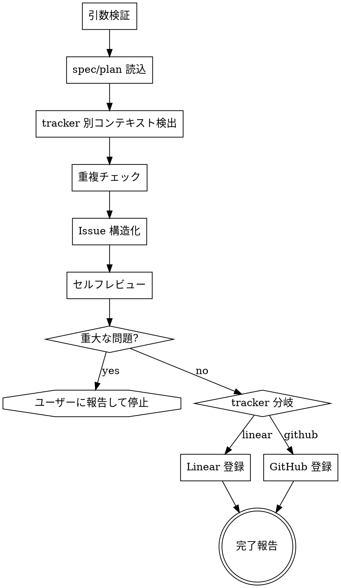

# Create Issue

`superpowers:brainstorming` が生成した spec と `superpowers:writing-plans` が生成した plan を入力に、Issue tracker（Linear / GitHub）に **親 Issue + sub-issue 群** を自律登録する。

## 引数

```
/create-issue <spec-path> <plan-path>
```

- `<spec-path>`: spec ファイルへの絶対 or 相対パス（例: `docs/superpowers/specs/2026-05-01-feature-x-design.md`）
- `<plan-path>`: plan ファイルへの絶対 or 相対パス（例: `docs/superpowers/plans/2026-05-01-feature-x.md`）

tracker は `.claude/project.yml` の `tracker.type` から自己解決する（引数では受け取らない）。

引数が不足している、パスが存在しない、もしくは `.claude/project.yml` が存在しない / `tracker.type` 未定義の場合は即座にエラーで停止する。**この時点でユーザー対話には戻らない**（呼び元の `feature-team` 親が再投入する想定）。

## 前提

- spec / plan ファイルは既に commit 済み、または少なくとも書き出し済みであること
- tracker 別の認証:
  - `linear`: `linear team list` が成功すること（`linear auth login` 済み）
  - `github`: `gh auth status` が成功し、リポジトリ root にいること
- `github` の場合、Project を操作するなら `gh auth refresh -s project` 済みであること

## このスキルが**しないこと**

- 対話によるアイデア深掘り（`superpowers:brainstorming` の役割）
- spec / plan 自体の修正（呼び元で修正してから呼び直す）
- 実装の着手（`feature-team` Phase 4 の責務）
- ユーザー承認待ち（自律パイプラインなのでセルフレビュー後に登録まで進む）

## 処理フロー



## 1. 引数検証

```bash
# パス存在
[[ -f "$1" ]] || abort "spec not found: $1"
[[ -f "$2" ]] || abort "plan not found: $2"

# 設定ファイル存在
[[ -f .claude/project.yml ]] || abort ".claude/project.yml not found. Define tracker.type before running create-issue."

# tracker.type 取得（yq があれば yq、なければ grep ベースの簡易抽出）
TRACKER_TYPE=$(yq -r '.tracker.type' .claude/project.yml 2>/dev/null || grep -E '^[[:space:]]+type:' .claude/project.yml | head -1 | awk '{print $2}')
[[ "$TRACKER_TYPE" == "linear" || "$TRACKER_TYPE" == "github" ]] || abort "tracker.type must be 'linear' or 'github' in .claude/project.yml"
```

tracker は引数で受け取らず、`.claude/project.yml` の `tracker.type` を必ず参照する。

`abort` は標準エラーにメッセージを出して停止する想定。失敗した場合、呼び元（`feature-team` 親）が再投入する。

## 2. spec / plan 読込

`Read` ツールで両ファイルを完全に読み込む。要点抽出は構造化フェーズで行うので、ここでは原文をメモリに置くだけでよい。

注意: spec / plan の長さは数百行に及ぶことがある。Issue 本文には**全文を貼らない**。

## 3. tracker 別コンテキスト検出

### 3-Linear: チーム情報

```bash
linear team list
```

複数チームがある場合、`.claude/project.yml` の `tracker.linear.team` を必ず参照する。指定がなければエラー停止して呼び元に「`.claude/project.yml` に `tracker.linear.team` が必要」と報告する（自律スキルなので推測しない）。

`tracker.linear.project_id` が指定されている場合、Issue 作成時に `--project` フラグ相当で関連付ける（linear-cli の対応状況に応じて運用）。

### 3-GitHub: リポジトリ情報と Project

```bash
gh repo view --json owner,name,defaultBranchRef \
  -q '{owner: .owner.login, repo: .name, defaultBranch: .defaultBranchRef.name}'
```

取得値: `OWNER` / `REPO` / `DEFAULT_BRANCH`

```bash
gh project list --owner <OWNER> --format json
```

- 0 個 → Project 関連処理をスキップ（Issue 作成は続行）
- 1 個 → 自動選択
- 2 個以上 → `.claude/project.yml` の `tracker.github.project_number` を参照。指定がなければエラー停止

```bash
gh project field-list <PROJECT_NUMBER> --owner <OWNER> --format json
```

Status フィールドと初期 status（"Ready"/"Todo"）の option ID を特定する。見つからなければ status 設定をスキップする。

## 4. 重複チェック

spec のタイトルから抽出したキーワードで既存 Issue を検索する。

### 4-Linear

```bash
linear issue mine --sort priority --team <TEAM>
```

タイトル一致や類似度の高い既存 Issue があれば**中断してユーザーに報告**する（自律スキルだが、重複は被害が大きいので例外的に停止判断）。

### 4-GitHub

```bash
gh issue list --repo <OWNER>/<REPO> \
  --search "<キーワード>" --state open \
  --json number,title,labels
```

中断条件は Linear と同じ。

## 5. Issue 構造化

spec / plan から以下を組み立てる。**全文コピーは禁止**で、要点抽出する。

### 5.1 親 Issue 本文

```markdown
## 目的・背景
<spec の "目的" / "背景" セクションを 5〜10 行に圧縮>

## 受入条件
- [ ] <spec の "受入条件" を抜粋>
- [ ] ...

## 関連ドキュメント
- Spec: <spec-path への参照リンク>
- Plan: <plan-path への参照リンク>

## サブタスク
1. <plan のステップ 1 タイトル>
2. <plan のステップ 2 タイトル>
...
```

ラベル: spec のフロントマターに `labels:` 指定があれば採用。なければ `feature` を既定。

### 5.2 sub-issue 本文（plan の各ステップから 1 つずつ）

```markdown
## 概要
<plan ステップの説明>

## 変更対象
- <ファイル A>
- <ファイル B>

## 受入条件
- [ ] <ステップ固有の完了条件>
- [ ] テストが追加されている

## 関連
- 親 Issue: #<番号>（GitHub） / <親 ID>（Linear）
- Spec: <spec-path>
- Plan: <plan-path>
```

依存関係: plan に「ステップ B はステップ A の後」と書かれていれば `blocks` / `blocked by` として扱う。

### 5.3 GitHub のみ — 設計コメント / 実装プランコメント

GitHub では親 Issue に以下のコメントを後から追加する想定:
- 設計コメント: spec の "アプローチ" "アーキテクチャ" セクションを抽出
- 実装プランコメント: plan の全ステップを順序付きで列挙

Linear は本文に含まれる情報量が多いので、コメント分離は不要。

## 6. セルフレビュー

登録前に以下を**機械的に**検証する。ユーザー承認は求めない。

### 6.1 整合性

- 親 Issue 本文の "サブタスク" 数と sub-issue 数が一致するか
- 受入条件に漏れがないか（spec の受入条件すべてが親 or どこかの sub-issue に含まれているか）
- sub-issue タイトルが plan のステップタイトルと一致するか

### 6.2 コードベース検証

- sub-issue で言及したファイル・モジュールが実在するか（`Glob` / `Grep` で確認）
- 既存の命名規約と整合するか（既存ファイル命名と乖離がないか）
- 依存として挙げた Issue 番号 / ID が実在するか

### 6.3 判定

- **軽微な修正で済む**（パス誤り、命名ズレ等）→ 自己修正して続行。修正内容を完了報告に含める
- **重大な問題**（前提モジュールの不在、アーキテクチャ乖離、依存先 Issue 消失）→ ユーザーに報告して停止する。`feature-team` 親が spec / plan を直して呼び直す

## 7. tracker 別登録

### 7-Linear: 登録

```bash
# 親 Issue 作成
PARENT_ID=$(linear issue create --team <TEAM> --title "<title>" --body-from-file <親本文ファイル>)

# Sub-issue 作成（順番に）
for STEP in <plan のステップ>; do
  SUB_ID=$(linear issue create --team <TEAM> --parent "$PARENT_ID" \
    --title "<sub title>" --body-from-file <sub 本文ファイル>)
  echo "Created: $SUB_ID"
done

# 依存関係（blocks / blocked by）を設定
# linear-cli は依存関係 CLI が限定的なので、必要なら本文の "## 関連" に明記して運用で対応
```

`linear issue create` が対話モードに落ちる場合に備えて `--team` を必ず明示する（`reference_linear_cli_commands.md` 参照）。

### 7-GitHub: 登録

```bash
# Step 1: 親 Issue 作成（body にサブタスクをタスクリスト形式で含める。番号は後で置換）
PARENT_NUM=$(gh issue create --repo <OWNER>/<REPO> \
  --title "<title>" --body-file <親本文ファイル> --label "<label>" \
  | grep -oE '[0-9]+$')

# Step 2: 各 sub-issue を作成
for STEP in <plan のステップ>; do
  SUB_NUM=$(gh issue create --repo <OWNER>/<REPO> \
    --title "<sub title>" --body-file <sub 本文ファイル> --label "<label>" \
    | grep -oE '[0-9]+$')
done

# Step 3: 親 Issue body のタスクリストを Issue 番号付きに更新
gh issue edit $PARENT_NUM --repo <OWNER>/<REPO> --body-file <更新後本文>

# Step 4: 設計コメント / 実装プランコメントを親に追加
gh issue comment $PARENT_NUM --repo <OWNER>/<REPO> --body-file <設計コメント>
gh issue comment $PARENT_NUM --repo <OWNER>/<REPO> --body-file <プランコメント>

# Step 5: Project 追加（検出された場合のみ）
# 重要: item-list は重い API。バッチパターンで item-add → item-list 1 回 → status 設定
for URL in <親 + sub 全 URL>; do
  gh project item-add <PROJECT_NUMBER> --owner <OWNER> --url "$URL"
done

ITEMS_JSON=$(gh project item-list <PROJECT_NUMBER> --owner <OWNER> --format json --limit 1000)
for NUM in <親 + sub 全番号>; do
  ITEM_ID=$(echo "$ITEMS_JSON" | jq -r ".items[] | select(.content.number == ${NUM}) | .id")
  [ -n "$ITEM_ID" ] && gh project item-edit \
    --project-id <PROJECT_ID> --id "$ITEM_ID" \
    --field-id <STATUS_FIELD_ID> --single-select-option-id <READY_OPTION_ID>
done
```

`item-list` の `--limit` は Project の既存アイテム数以上に設定する。

## 8. 完了報告

呼び元（`feature-team` 親）が Phase 3 以降で使えるよう、構造化された情報を返す:

```markdown
## ✅ create-issue 完了

**Tracker:** linear / github（`.claude/project.yml` の `tracker.type` で解決）
**親 Issue:** #<番号> または <Linear ID>  — <タイトル>
**Sub-issue 数:** N

### Sub-issues
- #<番号> — <タイトル>（依存: なし / blocks: #<番号>）
- #<番号> — <タイトル>（依存: blocked by #<前番号>）
- ...

### Spec / Plan 参照
- Spec: <spec-path>
- Plan: <plan-path>

### セルフレビュー
- ✅ 整合性: 問題なし
- 🔧 修正: <修正内容があれば列挙>
- ✅ コードベース検証: 全参照ファイル確認済み

### 次のステップ
`feature-team` Phase 3（ボリューム判断）に進む
```

## 失敗時の挙動

- 引数不正 / spec or plan 不在 → 即座にエラー停止（ユーザーが対話で直すのではなく、`feature-team` 親が再投入する想定）
- 認証エラー → 認証コマンドを案内して停止
- 重複検出 → ユーザーに報告して停止
- セルフレビュー重大問題 → ユーザーに報告して停止
- API レート制限 / ネットワーク → 1 度だけ再試行、それでも失敗ならエラー停止

## 呼び出し元

このスキルは以下のパターンで呼ばれる:

- `feature-team` Phase 2 — brainstorming + writing-plans が生成した spec / plan を入力に自律登録
- 単独実行 — spec / plan が手元にあるとき `/create-issue <spec> <plan>` で直接登録

いずれの場合も tracker は `.claude/project.yml` から自己解決するため、呼び出し側は tracker を引数で渡さない。
