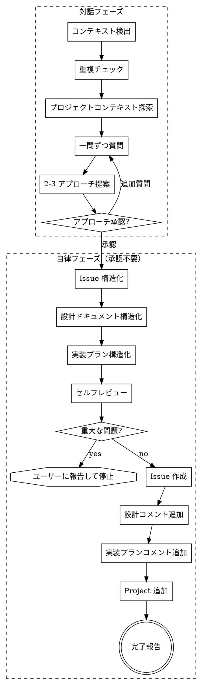

# GitHub Plan

曖昧なアイデアや要望を brainstorming で深掘りし、アプローチ合意後はセルフレビュー付きの自律パイプラインで GitHub Issue + 設計コメント + 実装プランコメントを作成する。

## 前提

- `gh` CLI が認証済みであること
- 対象リポジトリのワーキングディレクトリにいること
- GitHub Project を操作する場合、スコープ権限が必要（`gh auth refresh -s project`）

## コンテキスト検出

スキル起動時に以下を自動検出する。検出に失敗した場合はエラーメッセージとともに停止する。

### リポジトリ情報

```bash
gh repo view --json owner,name,defaultBranchRef -q '{owner: .owner.login, repo: .name, defaultBranch: .defaultBranchRef.name}'
```

取得する値:
- `OWNER`: リポジトリオーナー（ユーザーまたは Organization）
- `REPO`: リポジトリ名

### GitHub Project 検出

```bash
gh project list --owner <OWNER> --format json
```

- Project が 1 つ → 自動選択
- Project が複数 → 番号とタイトルを一覧表示し、ユーザーに選択を求める
- Project が 0 → Project 関連ステップをスキップ（Issue 作成は続行）

### Project フィールド情報（Project が見つかった場合）

```bash
gh project field-list <PROJECT_NUMBER> --owner <OWNER> --format json
```

Status フィールドを特定し、初期ステータス（「Ready」「Todo」等）に該当するオプション ID を取得する。
該当するオプションが見つからない場合、ステータス設定をスキップする。

## 処理フロー



### 1. 重複チェック

引数のアイデアからキーワードを抽出し、既存 Issue を検索する。

```bash
gh issue list --repo <OWNER>/<REPO> --search "<キーワード>" --state open --json number,title,labels
```

関連する既存 Issue があれば一覧を提示し、重複の可能性を指摘する。
重複がないことを確認してから次に進む。

### 2. Brainstorming（対話的な深掘り）

brainstorming スキルの対話手法を用いてアイデアを深掘りする。

#### 2a. プロジェクトコンテキスト探索

アイデアに関連するコードベースの現状を把握する:
- 関連するファイル・ディレクトリの構造
- 既存の実装パターン・規約
- 直近のコミット履歴（関連する変更があるか）

#### 2b. 一問ずつの質問

以下の観点で質問する。**一度に一問だけ**聞く。可能な限り選択肢形式にする。
ユーザーの回答が十分であれば、質問を省略して次に進んでよい。

- **目的・背景**: なぜこの機能が必要か
- **制約・スコープ**: 何を含み、何を含まないか
- **受入条件**: 何をもって完了とするか
- **影響範囲**: 既存機能への影響

#### 2c. 2-3 アプローチの提案

深掘りした内容をもとに、2-3 の実現アプローチを提案する:
- 各アプローチのトレードオフを明示する
- 推奨案とその理由を先頭に示す
- ユーザーに選択してもらう

**提案フォーマット:**

```
## アプローチ

### A) <アプローチ名>（推奨）
<概要>
- ✅ <メリット>
- ⚠️ <デメリット・注意点>

### B) <アプローチ名>
<概要>
- ✅ <メリット>
- ⚠️ <デメリット・注意点>

→ **推奨: A**。理由: <根拠>
```

### 3. 構造化（自律実行）

アプローチ承認後、以下の 3 つを**ユーザー承認なしで**構造化する。

#### 3a. Issue 本文

- タイトル
- 説明文（目的・背景。簡潔に）
- 受入条件（チェックリスト形式）
- ラベル
- サブタスク分割案（必要な場合。1 サブタスク = 1 Issue = 1 PR を基準）
- 他 Issue との依存関係（blocks / blocked by）

**フォーマット:**

```
## Issue 本文

**タイトル:** コーヒー器具のカテゴリ管理機能
**ラベル:** feature

**説明:**
コーヒー器具をカテゴリごとに管理できるようにする。
現状はフラットな一覧のみで、器具が増えると探しにくい。

**受入条件:**
- [ ] カテゴリの CRUD が実装されている
- [ ] 器具にカテゴリを紐づけられる
- [ ] カテゴリでフィルタリングできる

**サブタスク:**
1. カテゴリ API の実装
2. カテゴリ選択 UI の実装
3. フィルタリング機能の実装

**依存関係:** なし
```

#### 3b. 設計ドキュメント（Issue コメントとして追加）

選択したアプローチの設計詳細。以下を含む:
- 選択したアプローチの概要
- 検討した代替案とその棄却理由
- アーキテクチャ・コンポーネント構成
- データフロー
- エラーハンドリング方針

**フォーマット:**

```
## 設計コメント

### 選択アプローチ
<選択したアプローチの概要>

### 検討した代替案
- **<代替案 B>**: <棄却理由>

### アーキテクチャ
<コンポーネント構成・データフロー>

### エラーハンドリング
<方針>
```

#### 3c. 実装プラン（Issue コメントとして追加）

実装の進め方。以下を含む:
- 実装ステップ（順序付き）
- 各ステップで変更するファイル・モジュール
- テスト方針
- 注意点・落とし穴

**フォーマット:**

```
## 実装プランコメント

### ステップ
1. **<ステップ名>** — <変更対象ファイル>
   - <詳細>
2. **<ステップ名>** — <変更対象ファイル>
   - <詳細>

### テスト方針
- <テストの種類と対象>

### 注意点
- <落とし穴・気をつけること>
```

### 4. セルフレビュー（自律実行）

構造化した Issue 本文・設計コメント・実装プランを、Issue 作成前に検証する。

#### 4a. 整合性チェック

- brainstorming で合意した内容と構造化結果の一貫性
- 受入条件に漏れがないか
- サブタスク粒度が「1 サブタスク = 1 Issue = 1 PR」基準を満たすか
- 設計コメント・実装プランが Issue 本文と矛盾しないか

#### 4b. コードベース検証

- 実装プランで言及したファイル・モジュールが実在するか（glob/grep で確認）
- 既存の実装パターン・命名規約との整合性
- 依存関係として挙げた Issue が実在するか（`gh issue view` で確認）

#### 4c. 判定と対応

- **軽微な問題**（パス誤り、命名ズレ等）→ 自己修正して続行。修正内容を記録し、完了報告に含める
- **重大な問題**（前提モジュールの不在、アーキテクチャ乖離等）→ **ユーザーに問題を報告して停止する**。ユーザーの判断を得てから再開する

### 5. GitHub Issue 作成（自律実行）

セルフレビューを通過したら、承認を求めず Issue を作成する。

```bash
gh issue create --repo <OWNER>/<REPO> --title "<タイトル>" --body "<body>" --label "<ラベル>"
```

サブタスクがある場合:
1. 親 Issue を作成（body にサブタスクをタスクリスト形式で含める）
2. 各サブタスクを個別の Issue として作成
3. 親 Issue の body を更新し、タスクリストの項目を Issue 参照（`#番号`）に置換

タスクリスト形式の例:
```markdown
## サブタスク
- [ ] #749 カテゴリ API の実装
- [ ] #750 カテゴリ選択 UI の実装
- [ ] #751 フィルタリング機能の実装
```

### 6. Issue コメント追加（自律実行）

親 Issue に設計ドキュメントと実装プランをコメントとして追加する。

```bash
# 設計ドキュメントコメント
gh issue comment <ISSUE_NUMBER> --repo <OWNER>/<REPO> --body "<設計ドキュメント>"

# 実装プランコメント
gh issue comment <ISSUE_NUMBER> --repo <OWNER>/<REPO> --body "<実装プラン>"
```

### 7. GitHub Project に追加（自律実行・Project が検出された場合）

**重要:** `gh project item-list` は Project 内の全アイテムを返す重い GraphQL クエリ。
Issue ごとに呼ぶとレート制限に到達するため、以下のバッチパターンを使うこと。

```bash
# Step 1: 全 Issue（親 + サブタスク）を Project に追加（item-add は軽い API）
for url in <全 Issue URL のリスト>; do
  gh project item-add <PROJECT_NUMBER> --owner <OWNER> --url "$url"
done

# Step 2: item-list を 1 回だけ呼んで JSON をキャッシュ
ITEMS_JSON=$(gh project item-list <PROJECT_NUMBER> --owner <OWNER> --format json --limit 1000)

# Step 3: キャッシュした JSON から item ID を取り出してステータス設定
for num in <全 Issue 番号のリスト>; do
  ITEM_ID=$(echo "$ITEMS_JSON" | jq -r ".items[] | select(.content.number == ${num}) | .id")
  if [ -n "$ITEM_ID" ]; then
    gh project item-edit --project-id <PROJECT_ID> --id "$ITEM_ID" \
      --field-id <STATUS_FIELD_ID> --single-select-option-id <READY_OPTION_ID>
  fi
done
```

**注意:** `item-list` の `--limit` は Project 内の既存アイテム数以上に設定すること。

### 8. 完了報告

作成した Issue の一覧と、セルフレビューの結果を表示する:

```
Issue 作成完了:
- #748 - コーヒー器具のカテゴリ管理機能 (設計コメント・実装プラン付き)
  - #749 - カテゴリ API の実装 (Sub-task)
  - #750 - カテゴリ選択 UI の実装 (Sub-task)
  - #751 - フィルタリング機能の実装 (Sub-task)

セルフレビュー:
- ✅ コードベース検証: 全参照ファイル確認済み
- 🔧 修正: `src/models/category.ts` → `src/models/Category.ts`（命名規約に合わせて修正）
```

- セルフレビューで修正がなかった場合は「✅ セルフレビュー: 問題なし」と簡潔に報告する
- 次のステップとして `/issue-dev <Issue番号>` で開発を開始できることを案内する
